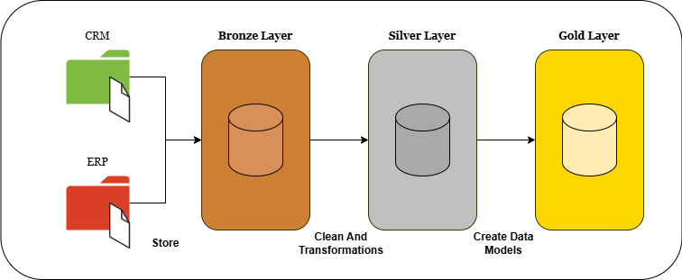
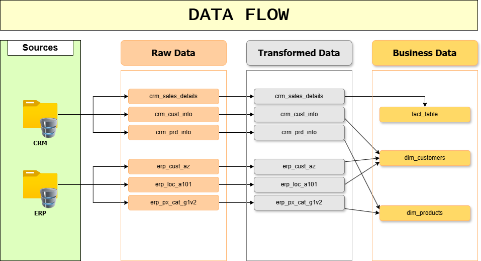

# End-to-End Data Warehouse Project (CRM & ERP Data)

This repository contains an end-to-end Data Warehouse project using a **medallion architecture** (Bronze, Silver, Gold layers) built with **SQL** and **Microsoft SQL Server**. The project integrates data from **CRM and ERP systems**, modeling it into clean, analytics-ready layers.

---

## 📌 Project Overview

This project simulates a real-world enterprise data warehouse pipeline. It involves:

- **Raw data ingestion** from CRM and ERP systems.
- **Transformation and cleansing** in the Bronze and Silver layers.
- **Dimensional modeling and analytics** in the Gold layer.



---

## 📊 Data Flow & Models

This image illustrates how data flows through each layer and includes the final schema for reporting and analysis.



---

## 🗂️ Project Structure
│   DataFlow.png
│   ProjectOverviw.png
│   README.md
│   
├───datasets
│   ├───source_crm
│   │       cust_info.csv
│   │       prd_info.csv
│   │       sales_details.csv
│   │       
│   └───source_erp
│           CUST_AZ12.csv
│           LOC_A101.csv
│           PX_CAT_G1V2.csv
│
└───scritpts
    │   init_databases.sql
    │
    ├───bronze
    │       create_raws_data.sql
    │       insert_to_row_data.sql
    │       load_bronze.sql
    │
    ├───gold
    │       view_Customer.sql
    │       view_Product.sql
    │       view_sales_facts.sql
    │
    └───Silver
            create_rows_silver.sql
            load_silver.sql

---

## 🛠️ Technologies Used
- **Microsoft SQL Server**
- **Windows Environment**

---

## 💡 Layers Explanation

- **Bronze Layer**: Raw data from CRM and ERP systems is loaded here without transformation.
- **Silver Layer**: Data is cleansed, joined, and transformed into a more usable format.
- **Gold Layer**: Analytical models and star schemas are built for BI/reporting.

---

## ✅ How to Use

1. Clone the repository:
   ```bash
   git clone https://github.com/ISSAM-SALMI/BI-EndToEndProject.git
=======
# BI-EndToEndProject
